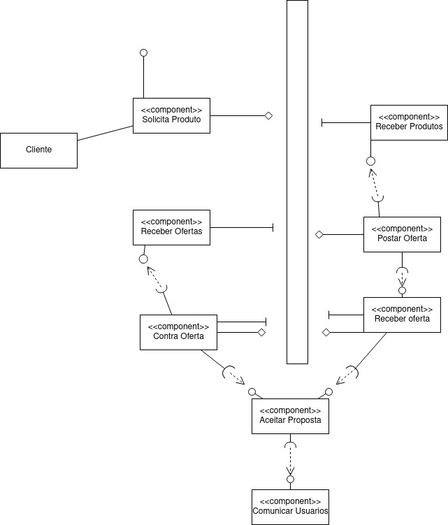
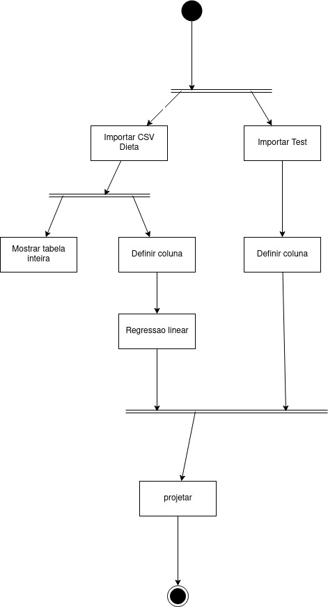

# Apresentação do Lab03 - Coreografia e Orquestração no Brechó Online

# Aluno
* `Alejandro Boidi Rico`

## Tarefa 1 - Detalhando a Negociação das Ofertas

### a

Representando cada DTO de forma separada. Nossas entidades são: **Vendedor, Comprador, Produto**

- Vendedor
~~~JSON
{
    "produtos_mais_vendidos": [0, 1],
    "regioes": [123, 21, 190, 10101],
    "categorias_mais_vendidas":[1, 3, 0],
    "preco_range": [0.00, 10000.00]
}
~~~

- Comprador
~~~JSON
{
    "produtos_mais_comprados": [0, 1],
    "regioes": [123, 21, 190, 10101],
    "categorias_mais_comprados":[1, 3, 0],
    "preco_range": [0.00, 10000.00]
}
~~~

- Produto
~~~JSON
{
    "categoria_id": 0,
    "preco_minimo":1.00,
    "preco_maximo":3.00,
    "regioes_mais_vendidas": [0, 1, 3],
    "preco_mais_comprado": 2.00,
    "categorias": [0, 1, 2]
}
~~~

### b

O sistema funciona de forma assíncrona, serviços responsáveis por passos diferentes e responsáveis apenas por aquele passo.

- Comprador
    - Faz a solicitação de um produto específico ou de ofertas genéricas através dos tipos de produtos mais comprados
    - Ele pode aceitar ofertas ou criar uma contra proposta assim que receber ofertas.

- Vendedor
    - Vendedor por criar uma oferta ou receber solicitações
    - Integragindo com os clientes, podendo aceitar ou criar contra ofertas de produtos

- Sistema
    - Sistema fará a comunicação através de um barramento de mensagens, podendo ser mensageria ou banco de dados ou memória.
    - Cada componente é individual e não precisa dos outros serviços para funcionar, apenas o barramento de comunicação.
    - Sistema de ambos os lados deverá tratar mensagens de aceitação de oferta, comunicar os usuários e  completar a transação.

## Tarefa 2 - Recomendação de Preço

### a

[Workflow](orange_data_scatter)

### b

